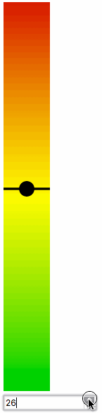

# React SVG Vertical Linear Gauge

Vertical SVG Linear Gauge component, inspired by [react-svg-gauge](https://github.com/Reggino/react-svg-gauge) and [Linear gauge with gradient @CodePen](https://codepen.io/VicM/pen/NPGqwr)

## Example



## Example Use
```jsx
import React, { Component } from 'react';
import LinearGauge from './LinearGauge';

export default class App extends Component {
    constructor(props) {
        super(props);
        this.state = {
            value: 20,
            unit: 'C'
        };
    }
    updateValue(e){
        return this.setState({
            value: e.target.value
        })
    }
    render() {
        return (
            <div>
                <h3>Linear Gauge</h3>
                <LinearGauge GHeight={500} GWidth={120} height={300} width={60} max={50} value={this.state.value}/>
                <div><input onChange={this.updateValue.bind(this)} value={this.state.value} type="number" /></div>
            </div>
        )
    }
}
```